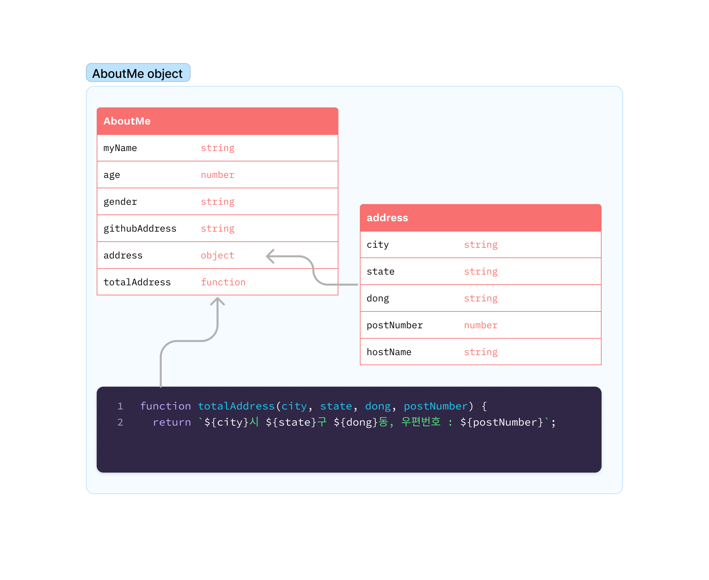
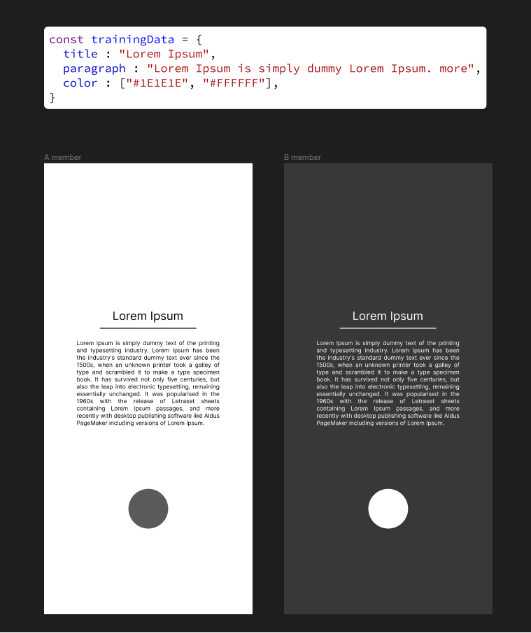

# Pair Coding 2023년 2월 28일
## Training 10
많은 데이터를 관리해야 하는 개발자의 고충 때문에, 머리가 아픈 개발자들은 '하나로 묶어' 생각하는 것을 고안해 냈습니다. 바로 객체(object) 그것입니다. 초창기 C언어로부터 C++가 탄생하게 된 배경도 전적으로 데이터타입에서 '객체'를 추가하는 것에 초점이 맞춰질만큼 매우 유용한 데이터 타입입니다. 이것을 비유를 섞어 래핑(wrapping)한다고 표현하면서, 자바스크립트에서는 '객체(object)' 라고 사용하지만, 다른 언어에서는 클래스, 구조체, 딕셔너리 등 갖가지 이름으로 불리고 있는 매우 중요한 프로그래밍 '일반(standard)' 개념입니다.

본 예제의 표는 이러한 객체를, 혹은 하나의 상징으로 묶어서 담을 수 있는 값들의 모음을 규격화한 대표적인 개발자들만의 설계 서류의 예시 입니다. 개발자들은 관리자가 작성한 본예제와 같은 레퍼런스를 활용하여 작업을 진행합니다. 이러한 설계서류와 같은 것을 UML 이라고 부르며 다양한 형식이 존재하지만, 목적은 '모든 개발자가 한눈에 알아볼 수 있는 규격'을 목표로 하고 있습니다.

예제의 가장 최상위 는 AboutMe 라는 이름의 객체가 되며, 그중 하위 개념으로 address 개념이 들어온 것을 확인 할 수 있습니다. 하나의 구조가 만들어지는 것과 '데이터타입'을 명세화 했기 때문에 매우 중요한 기준표이기도합니다.

자세히 들여다보시면 우리가 현재 다루고 있는 HTML의 구조와 동일한 것도 함께 확인하실 수 있습니다. 직접 만들어보면서 데이터를 가공하는 메서드도 제작해보시기 바랍니다. 거의 모든 소프트웨어 작업에서 빼놓을 수 없는 구축패턴이므로 다수의 연습과 훈련이 필요한 부분입니다.

## Training 11
회사에서 관리하는 데이터베이스는 일반적으로 일원화 하기 때문에 본 예제 처럼 데이터가 '하나' 인 경우가 많습니다. 이것을 각자 분업하여 작업을 동시에 진행하는 경우가 매우 잦습니다. 

매우 자주 사용하고, 또 경험이 많은 다크모드 인터렉션 구현을 목표로 하나의 데이터로부터 '동적'으로 문서를 만들어주는 인터렉션을 구현해보시기 바랍니다.

